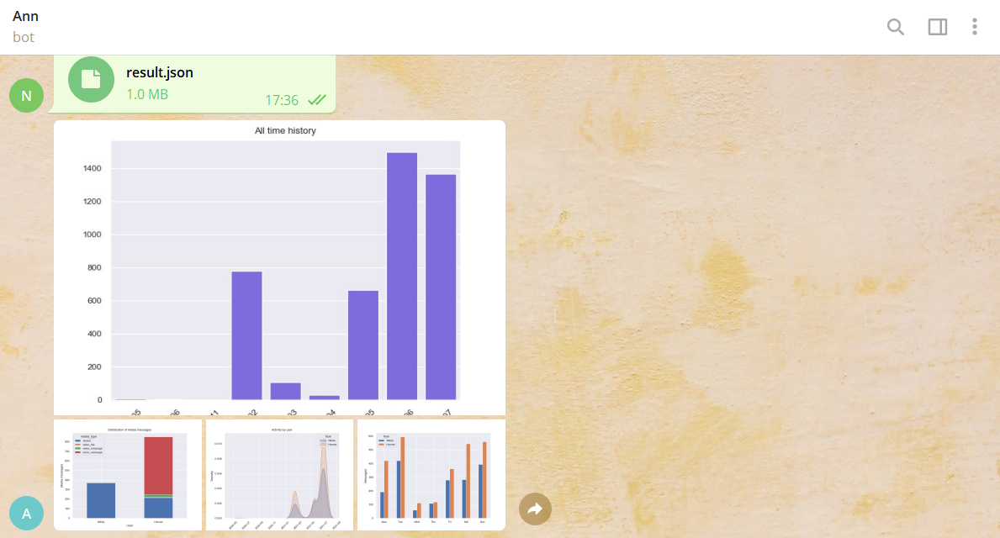
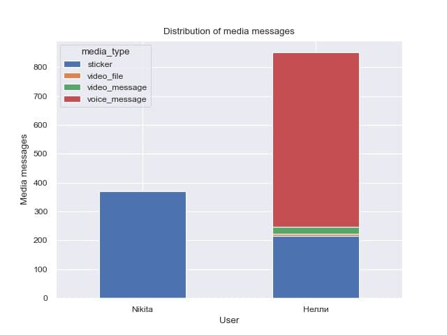
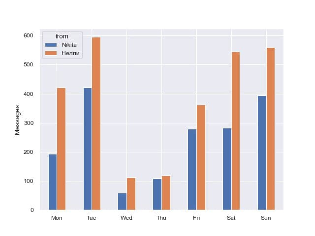

# About
[This Telegram bot](https://t.me/data_is_power_bot) is build with [python-telegram-bot](https://github.com/python-telegram-bot) library.
It's main goal is to let users of Telegram to easily visualize their messaging history. It requires a file with the
history exported in json format. Based on this file bot produce a few plots and sends them back to user.
[Heroku](https://www.heroku.com/what) is used for hosting. Pandas and Seaborn used for operating with data.

# Examples

